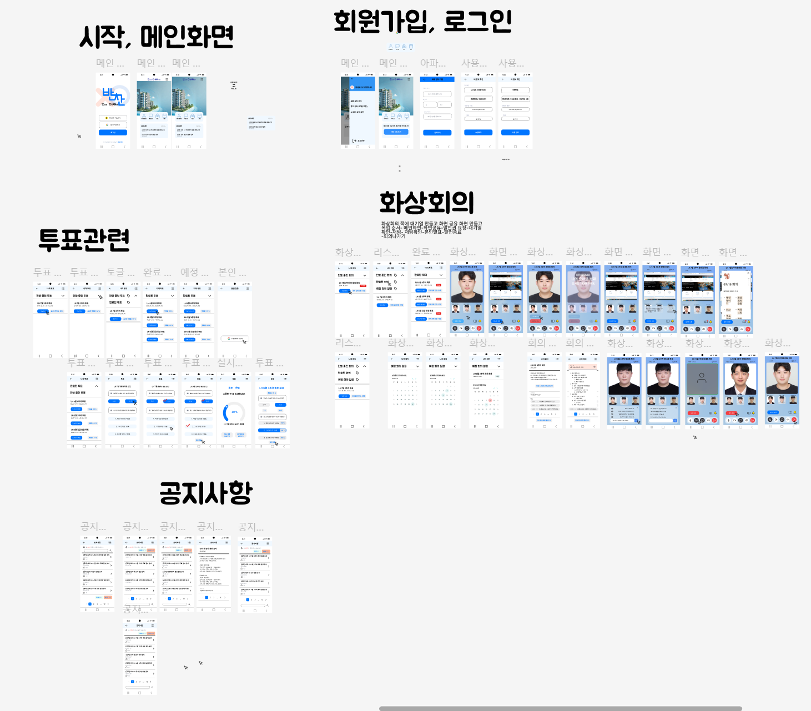
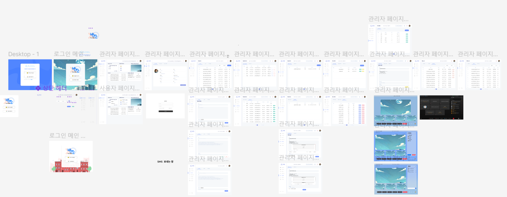
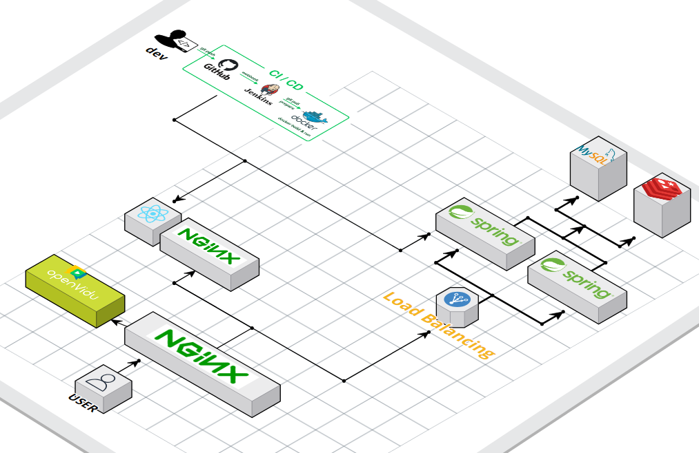
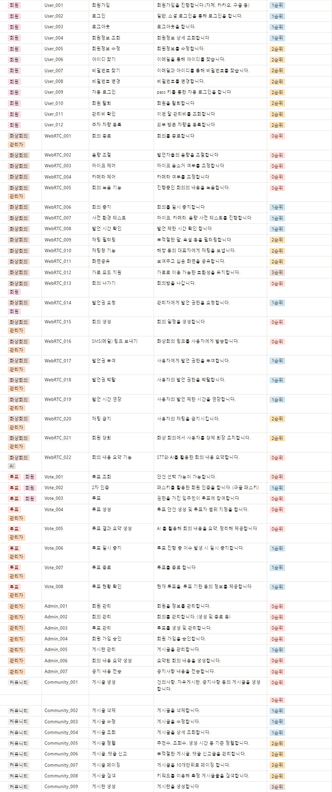
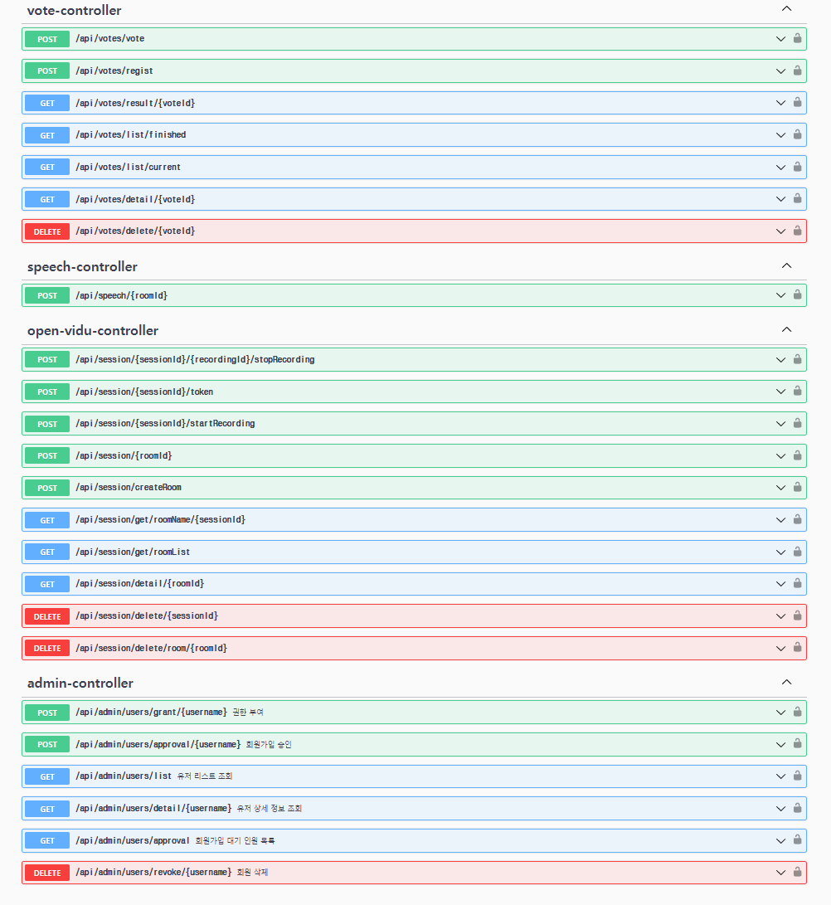

## Choose between 반대 or 찬성!!, 반찬(Banchan)📝

## *"주민 여러분께 알립니다. 오후 6시 201동 105호에서 반상회가 있을 예정이오니 늦지않게 참가 바랍니다."*

## 목차
1. [기획 의도 및 기대 효과](#1-기획-의도-및-기대-효과)
2. [개발 환경](#2-개발-환경)
3. [주요 기능](#3-주요-기능)
4. [기술 소개](#4-기술-소개)
5. [설계 문서](#5-설계-문서)
6. [팀원 소개](#6-팀원-소개)

## 1. 기획 의도 및 기대 효과
지역 주민들이 직접 모여 의견을 나누고, 중요한 사안을 논의하는 "전통적인 반상회"는 주민들의 결속력을 강화하는 중요한 역할을 해왔으며 주민들의 목소리를 빠른 시일내에 반영하였습니다. 하지만 현재 바쁜 일상과 시간적 제약, 그리고 사회적 분위기로 인해 참석을 꺼려 하는 경우가 많습니다. 이에 따라, 온라인을 통해 누구나 쉽게 참여할 수 있는 새로운 형태의 익명 반상회 플랫폼 "반찬"을 기획하게 되었습니다.

"반찬"은 다양한 기술을 통해 물리적 제약을 넘어서는 소통의 장을 마련하고자 하며 주민들은 언제 어디서나 손쉽게 참여할 수 있으며, 다양한 의견을 실시간으로 나누고 공동의 결정을 내릴 수 있습니다. 특히, 온라인 주민투표 기능을 통해 지역 사회의 중요한 이슈에 대해 모든 주민이 평등하게 의견을 제시하고, 온라인 화상 주민회의를 통해 직접 대면하지 않더라도 서로의 생각을 나눌 수 있는 기회를 제공합니다.

"반찬"은 주민 간의 소통을 강화하여 더 나은 공동체를 만들기 위한 도구로서 기획되었습니다. 궁극적으로는 지역 사회의 모든 구성원이 자신의 목소리를 낼 수 있는 평등한 플랫폼을 제공하여, 보다 협력적이고 민주적인 지역 사회를 실현하고자 합니다.

## 2. 개발 환경
### Frontend
| Name | Version |
| --- | --- |
| Typescript | 5.2.2 |
| React | 18.3.1 |
| NodeJs | 20.16.0 |

### Backend
| Name | Version |
| --- | --- |
| Java | 17 |
| Spring Boot | 3.3.2 |
| MySql | 8.0 |
| Redis | 7.4.0 |

### Infra
| Name | Version |
| --- | --- |
| Docker | 27.1.1 |
| Docker Compose | 2.29.1 |
| Nginx | 1.27.0 |

### CI/CD
| Name | Version |
| --- | --- |
| Jenkins | 2.462.1 |

## 3. 주요 기능
### 소셜 로그인 기능

### 투표 기능

### 화상회의 기능

### 회의 요약본 기능

## 4. 기술 소개

1. **Google STT(Speech-to-Text) API**
    - **서비스 이름**: Google Cloud Speech-to-Text API
    - **사용 목적**: 음성을 텍스트로 변환하여 사용자 입력을 처리
    - **사용 방법**: 
        - Google Cloud Platform에서 계정 생성 후 프로젝트 생성.
        - Speech-to-Text API를 해당 프로젝트에 활성화.
        - API 키 또는 서비스 계정을 생성하여 인증 정보 확보.
    - **API KEY**: 보안상 API 키는 별도 관리
    - **활용 방법**: 
        - 음성 데이터를 STT를 이용하여 텍스트로 변환.
        - 1분 이상의 오디오의 경우, GCP 업로드가 필수적으로 요구되므로 비동기로 오디오 분할.
        - 기존의 오디오 파일을 전처리 (모노 채널 설정 및 샘플링 주파수 설정).
        - 텍스트화된 음성 파일을 txt 파일로 저장하여 추후에 활용.

2. **GPT-4o mini**
    - **서비스 이름**: GPT-4o mini
    - **사용 목적**: 텍스트 데이터를 기반으로 한 자연어 처리 및 텍스트 요약
    - **사용 방법**: 
        - OPENAI API 키 발급.
    - **API KEY**: 보안상 API 키는 별도 관리
    - **활용 방법**: 
        - Google STT API로 변환된 텍스트를 GPT-4o mini에 전송하여 자연어 이해 및 대화 응답 생성.

3. **카카오 소셜 로그인**
    - **서비스 이름**: Kakao Social Login (카카오 소셜 로그인)
    - **사용 목적**: 사용자들이 카카오 계정을 사용해 손쉽게 로그인할 수 있도록 함
    - **가입 절차**:
        - Kakao Developers에서 계정 생성 후 애플리케이션 등록.
        - '카카오 로그인' 기능을 활성화하고 Redirect URI 설정.
        - JavaScript 키 및 REST API 키 발급.
    - **API KEY**:
        - JavaScript 키: (보안상 API 키는 별도 관리)
        - REST API 키: (보안상 API 키는 별도 관리)
    - **활용 방법**:
        - 프론트엔드에서 JavaScript SDK를 사용해 로그인 버튼 구현.
        - 사용자가 카카오 계정으로 로그인 시, 서버 측에서 REST API를 활용해 사용자 정보 조회.

4. **OpenVidu**
    - **서비스 이름**: OpenVidu
    - **사용 목적**: 실시간 화상 회의 및 스트리밍을 웹 애플리케이션에 통합하기 위한 플랫폼
    - **사용 방법**:
        - OpenVidu 서버 설치:
            - 공식 문서의 On Premiss 방식으로 설치.
            - 설치 후, OpenVidu 서버의 URL과 기본 인증 정보 설정.
        - 클라이언트 통합:
            - JavaScript 라이브러리를 사용해 웹 애플리케이션에 화상 통신 기능을 구현.
            - OpenVidu Node.js 클라이언트 또는 REST API를 사용해 서버와 상호작용.
        - 세션 생성 및 참가:
            - 서버 측에서 세션 생성 후, 클라이언트가 해당 세션에 참가할 수 있는 토큰을 발급.
            - 클라이언트는 이 토큰을 이용해 화상 회의에 참여하거나 스트리밍을 시작.
    - **활용 방법**:
        - 실시간 화상 회의:
            - 여러 사용자가 동시에 참가할 수 있는 화상 회의를 제공.
            - 참가자들 간의 실시간 비디오 및 오디오 스트리밍을 지원.
        - 스트리밍 및 녹화:
            - 세션을 라이브 스트리밍하거나 녹화하여 이후에 사용할 수 있음.
        - 화상 통화 및 화면 공유 기능 구현:
            - 웹 애플리케이션 내에서 화면 공유와 화상 통화 기능을 제공하여 협업 도구로 활용 가능.

## 5. 설계 문서
### 와이어 프레임 Mobile

### 와이어 프레임 Web

### 시스템 아키텍쳐

### ERD

### 요구사항 정의서

### API명세서

## 6. 팀원 소개

| **[최동호](https://carpal-butterfly-bd7.notion.site/11-_-1-_E105_-_-_-f7e17ad039c44fcd9824176ec62b8f68?pvs=4)** | **[최재용](https://cotton-hornet-992.notion.site/SSAFY-5881a668df744a1d861cc8de0ecfe28a?pvs=4)** | **[김하휼]** | **[윤동환]** | **[정진우]** | **[김동건](https://fluffy-hippodraco-222.notion.site/201-105-2e4535a37b2b4672951a6e86f655d62b)** |
|:---:|:---:|:---:|:---:|:---:|:---:|
|  |  |  |  |  |  |
| Backend | Backend | Frontend | Frontend | Frontend | Infra |

**Backend**
- 최동호 : 팀장 / 회원 및 인증 관련(OAuth, JWT) 유저, 관리자API / 패스키 구현 / UCC 제작 / 발표
- 최재용 : ERD 설계 및 DB 구축 / 공지사항, 건의사항, 투표 관련 API / WebRTC 서버 연동 및 화상회의 관련 API / STT와 AI를 활용한 회의 요약 서비스 구현 / 서버 에러 수정

**Frontend**
- 김하휼 : 웹/앱 전체적인 UI/UX 구현 / 화상 회의 관리 API 연동 / WebRTC 기반 환경 세팅 및 STT 데이터, 실시간 통신 처리
- 윤동환 : 프로젝트 기획 / 목업(피그마) 제작 / 시스템 아키텍쳐 등 산출물 제작 /유저 관리 및 인증(JWT, Oauth) 관련 api 연동 / 발표 자료 제작
- 정진우 : 와이어 프레임 제작/ 공지사항, 건의사항, 투표 관련 페이지 제작/ SMS 전송 시스템 구현 / 버전관리 시스템(git) 총괄 관리

**Infra**
- 김동건 : 개발환경 구축(프론트엔드&백엔드 도커 설정) / 배포환경 구축(리버스프록시 및 openvidu서버) / CI/CD자동배포-젠킨스 / 수동배포-쉘코드 / 포팅매뉴얼 및 기타 산출물 관리
